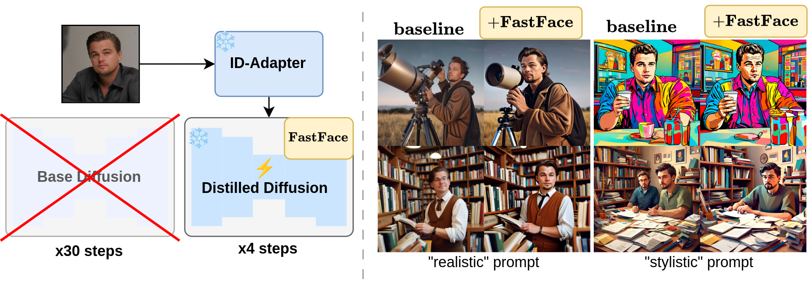

# FastFace: Tuning Identity Preservation in Distilled Diffusion via Guidance and Attention

<a href="https://arxiv.org/abs/2505.21144"><a>
[](./LICENSE)

>In latest years plethora of identity-preserving adapters for a personalized generation with diffusion models have been released. Their main disadvantage is that they are dominantly trained jointly with base diffusion models, which suffer from slow multi-step inference. This work aims to tackle the challenge of training-free adaptation of pretrained ID-adapters to diffusion models accelerated via distillation - through careful re-design of classifier-free guidance for few-step stylistic generation and attention manipulation mechanisms in decoupled blocks to improve identity similarity and fidelity, we propose universal FastFace framework. Additionally, we develop a disentangled public evaluation protocol for id-preserving adapters.
>



## Updates

- **2025/5/27**  arxiv preprint release


## Installation

Clone repository, `cd` to directory and run following commands:

```bash
python -m venv env
source activate env/bin/activate
pip install -r requirements.txt
pip install onnxruntime-gpu==1.18.0 --extra-index-url https://aiinfra.pkgs.visualstudio.com/PublicPackages/_packaging/onnxruntime-cuda-12/pypi/simple/
```

**🚩 Important:** depending on underlying versions of `cudnn` and `cuda` backend you might need to tweak installation of `onnxruntime-gpu` for it to work with gpu (everything will work with cpu version, just slower). For further details about recommended version refer to [this issue comment](https://github.com/microsoft/onnxruntime/issues/21684#issuecomment-2375853992) and official documentation.

During running all checkpoints and models are installed in local `models_cache/` directory.

## Evaluation dataset

We additionally release identities and prompts (realistic and stylistic) used for evaluation. Samples of identities are given in figure below.

<p align="center">

</p>

To download, activate environment created during [Installation](#installation) and run `download_data.sh` - data will be downloaded in local `data/` directory. 

## Run

For running inference on aribtrary identity/prompt pair, refer to `notebooks/inference_example.ipynb`. To run a widescale evaluation with our evaluation dataset, execute `diff_eval_idadapter.py`, refer to script for arguments details (remember to download dataset first). Basic command to run method on full data with Hyper checkpoint is given below:

```bash
python diff_eval_idadapter.py --target_adapter="faceid"\
 --ips=0.8 --lora_scale=0.8\
 --data_dir="data/"\
 --config_dir="configs/fastface/am1_and_dcg.json"\
 --ds_type="realistic"\
 --out_dir="res"\
 --exp_title="example_run"\
 --include_hyper_4\
 --device="cuda:0"
```

## Citation

If you find this work useful, please cite it as follows:

```bibtex
@article{karpukhin2025fastfacetuningidentitypreservation,
  title={FastFace: Tuning Identity Preservation in Distilled Diffusion via Guidance and Attention},
  author={Sergey Karpukhin, Vadim Titov, Andrey Kuznetsov, Aibek Alanov},
  journal={arXiv},
  year={2025},
}
```